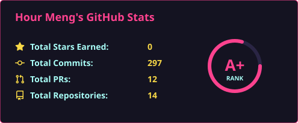

  

  <h1>Hi there, I'm <a href="https://github.com/Hour-Meng">Hour Meng</a> </h1>

  &nbsp;&nbsp;
  &nbsp;&nbsp;
  &nbsp;&nbsp;

  <h3> 🙎 Hour Meng | 💻 Software Engineer | 🛸 Phnom Penh, Cambodia </h3>

  <h5><i>⚡️ vincit qui se vincit ⚡️</i></h5>

 

### 👨‍💻 First-year Software Engineering student at KITH (Kirirom Institute of Technology)

- 🚀 Passionate about software engineering, system architecture, and automation
- 🏆 Actively learning, competing in hackathons, making connections, and building a strong reputation
- 🧠 Continuous self-improvement and self-mastery — *"No one can break me but myself"*
- 🥀 Learning **Angular** and modern frontend frameworks
- <i>with Python, Java, Lua, Luau, PostgreSQL, MySQL and others.</i>
- 🏍️ Big enthusiast of Cruiser motorcycles (Harley-Davidson, Indian Motorcycle)
- 💬 Connect? Let's chat 👉 <a href="https://t.me/EangHourMeng">Telegram (@EangHourMeng)</a>

 

  <h4>📊 Software Engineering | GitHub Stats</h4>

  

 

  <h3>🛠️ Languages and Tools...</h3>

  
  
  
  
  
  
  
  
  
  
  
  
  

 

  <h3>🎧 What I Do & Listen To</h3>

 

  

 

  <h2>🤝 Support</h2>
  
🎀 Contributions (<a href="https://guides.github.com/introduction/flow">GitHub Flow</a>), 🔥 issues, and 🥮 feature requests are most welcome!

  
💙 If you like my projects, Give them ⭐ and Share it with friends!

   
  
Made with ❤️ in Phnom Penh, Cambodia

  <h1>⚡️<i>Stay awesome!</i>⚡️</h1>

