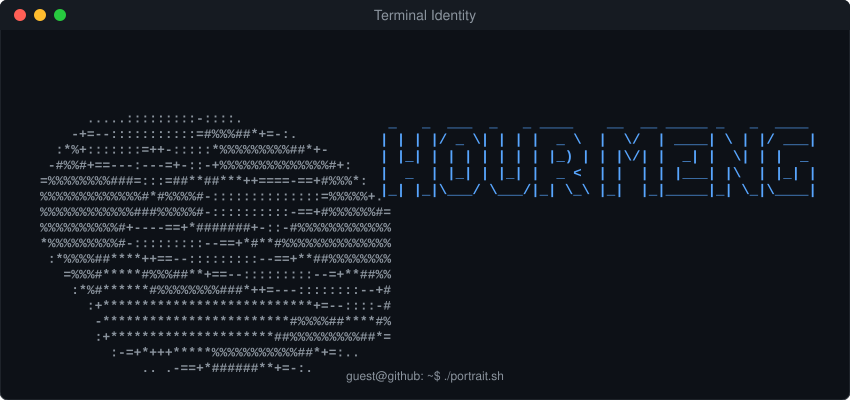

  

  

---

## 🙋‍♂️ Introduction

I'm **Hour Meng**, a developer passionate about building useful projects, learning modern technologies, and continuously improving my skills.  
I enjoy turning ideas into practical solutions and sharing my coding journey through GitHub.

- 🌱 Currently learning and exploring new tools & frameworks
- 💻 Interested in software development, automation, and open-source
- 🎯 Goal: Build impactful projects and grow as an engineer

---

## 🛠️ Technology Stack

  
  
  
  
  
  
  
  
  
  

---

## 📊 GitHub Activity & Insights

  

<!-- GitHub Streak & Stats -->

  

---

## 🔥 Contribution Graph

<!-- GitHub Activity Graph -->

  

---

## 🧩 LeetCode Stats

  

---

## 🎵 Spotify - Recently Played

  

---

## 🤝 Connect With Me

  

